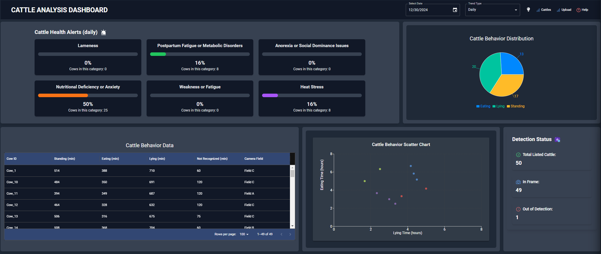

# Cow Monitoring and Identification System

### **Overview**

This repository contains a comprehensive system for monitoring and identifying cows in a barn using cutting-edge deep learning and machine learning techniques. The system automates the detection, tracking, and identification of cows, with a user-friendly visualization via a React.js dashboard. This enhances barn management and provides valuable insights into cow behavior.

---

### **Key Features**
- **Object Detection**: Detect cows in real-time using YOLOv8 for precise localization.
- **Object Tracking**: Monitor their movements across the barn to understand patterns and behaviors.
- **Identification**: Recognize individual cows using a machine learning algorithm based on stickers.
- **Visualization**: View real-time data and results on an interactive React.js dashboard.

---

### **System Architecture**

```plaintext
+-----------------------+         +-----------------------+         +-----------------------+
|   Input Video Feed    | ----->  | Object Detection      | ----->  | Object Tracking       |
| (Barn surveillance)   |         | (YOLOv8)             |         | (DeepSORT or YOLOv8)  |
+-----------------------+         +-----------------------+         +-----------------------+
            |                                                                   |
            v                                                                   v
+-----------------------+         +---------------------------------------------+
| Identification        | ------> | React.js Dashboard for Visualization       |
| (Sticker-based YOLO)  |         | (Displays detection, tracking, ID data)    |
+-----------------------+         +---------------------------------------------+
```

---

### **Flowchart**

```plaintext
[ Video Input ] --> [ YOLOv8 Detection ] --> [ DeepSORT Tracking ] --> [ YOLO Identification ]
                        |
                        v
[ Data Logging ] <--- [ React.js Visualization ]
```

---

### **Detailed Code Explanation**

#### **1. Object Detection**
- **File**: `backend/detection.py`
- **Description**: Detects cows in video frames using YOLOv8.
- **Key Functionality**:
  - Loads the YOLOv8 model pre-trained on a barn dataset.
  - Processes video frames and outputs bounding boxes and confidence scores.

#### **2. Object Tracking**
- **File**: `backend/tracking.py`
- **Description**: Tracks detected cows across frames to maintain consistency in identification.
- **Key Functionality**:
  - Uses DeepSORT (or integrated YOLO tracking) to handle tracking even with partial occlusion.
  - Assigns a unique ID to each cow for subsequent identification.

#### **3. Individual Identification**
- **File**: `backend/identification.py`
- **Description**: Identifies individual cows using a YOLO shape identification algorithm.
- **Key Functionality**:
  - Extracts features from detected bounding boxes, focusing on stickers.
  - Compares sticker features using a trained ML model to match identities.

#### **4. Visualization**
- **File**: `dashboard/src/App.js`
- **Description**: React.js application displaying detection, tracking, and identification data.
- **Key Components**:
  - **Live View**: Displays real-time video with overlaid detection and tracking info.
  - **Data Analytics**: Provides insights like cow count, movement patterns, and ID logs.

---

### **Images**

Visual demo of the entire app

1. 

---

### **Folder Structure**

```plaintext
cow-monitoring-system/
├── backend/
│   ├── detection.py         # YOLOv8 detection logic
│   ├── tracking.py          # DeepSORT tracking integration
│   ├── identification.py    # ML-based identification
│   ├── main.py              # Central script orchestrating the backend
├── dashboard/
│   ├── src/
│   │   ├── components/      # React.js UI components
│   │   ├── App.js           # Main React.js application
│   └── public/              # Static assets
├── input/                   # Video feed input directory
├── output/                  # Processed results
├── requirements.txt         # Python dependencies
└── README.md                # Project documentation
```

---

### **Installation and Usage**

#### **Installation**
1. Clone the repository:
   ```bash
   git clone https://github.com/your-username/cow-monitoring-system.git
   cd cow-monitoring-system
   ```
2. Install dependencies:
   ```bash
   pip install -r requirements.txt
   cd dashboard
   npm install
   ```

#### **Usage**
1. Start the backend:
   ```bash
   python backend/main.py
   ```
2. Launch the dashboard:
   ```bash
   npm start
   ```
3. Upload barn video feeds to the `input/` directory and monitor results on the dashboard.

---

### **Future Enhancements**
- Integrate more robust tracking for occlusion handling.
- Use alternative identifiers (e.g., RFID or patterns) for better accuracy.
- Extend the system for additional livestock behavior analysis.

---

